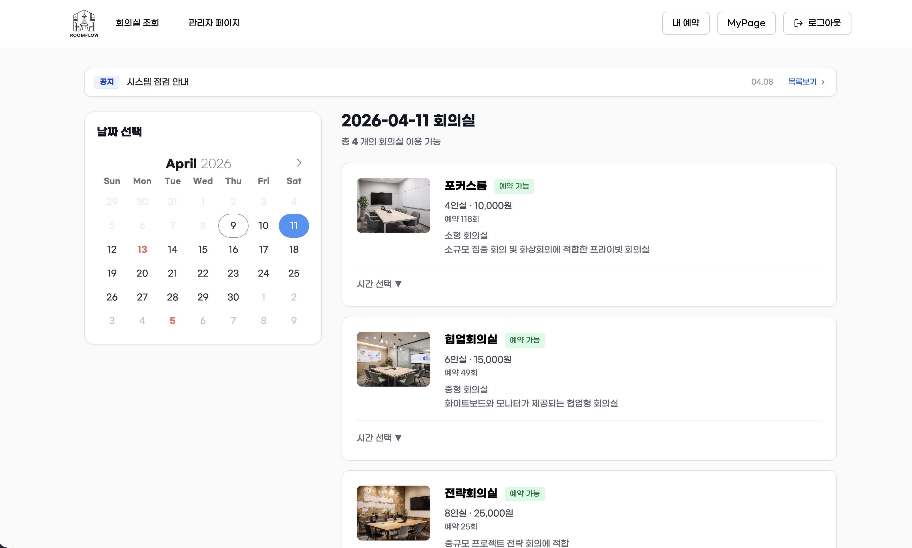
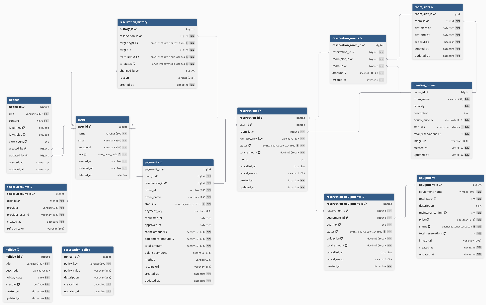
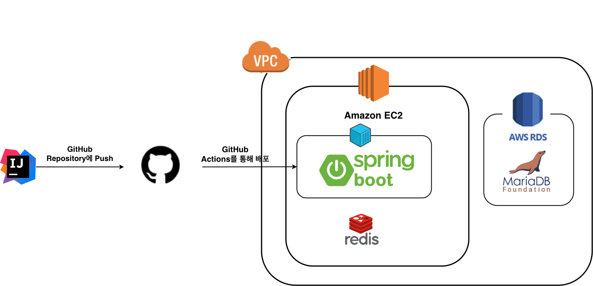

# Room Flow

### 회의실 예약 및 자원 관리 시스템 RoomFlow

> 사용자는 날짜별 회의실 예약 가능 여부를 확인하고 회의실과 비품을 예약할 수 있으며,
관리자는 회의실·비품·시간슬롯·공지사항·휴일·정책·매출을 통합 관리할 수 있습니다.

## 프로젝트 개요
RoomFlow는 조직 내 회의실과 비품 예약을 효율적으로 관리하기 위한 시스템입니다.

다음과 같은 문제를 해결합니다.
- 시간 슬롯 기반 예약 관리
- 회의실 예약 충돌 방지
- 비품 재고 동시성 처리
- 예약 정책 기반 제한
- 관리자 통합 운영 기능 제공

## 주요 기능

### 🏢 회의실 예약 기능
- 날짜 기준 예약 가능 회의실 조회
- 시간 슬롯 단위 예약
- 예약 상태 관리

### 📦 비품 예약 기능
- 회의실 예약 시 비품 추가 가능
- 재고 기반 예약 제한
- 폴링을 통한 실시간 재고 관리

### 👤 사용자 기능
- 회원가입 / 로그인
- 소셜 로그인(Google, Kakao, Naver)
- 개인 정보 조회
- 회의실 예약 및 취소
- 예약 내역 조회
- 계정 탈퇴 및 7일 내 복구

### 결제 시스템
- 회의실, 비품 예약시 결제 승인 처리 가능
- 결제 영수증 출력
- Toss Payment API 적용

### ⚙️ 관리자 시스템

📊 매출 관리
  - 날짜별 매출 내역 조회
  - 회의실 / 비품 매출 집계
  - 엑셀 다운로드 지원

👥 회원 관리
  - 회원 목록 조회
  - 메일 전송

🛠 시스템 관리
  - 회의실 및 비품 관리
  - 시간 슬롯 관리
  - 정책 관리
  - 휴무일 관리
  - 공지사항 관리

📋 예약 관리
- 전체 예약 내역 검색 및 조회
- 오늘 예약, 예정된 예약, 지난 예약 필터링
- 관리자 권한으로 예약 취소 기능

### 📢 공지사항 기능
사용자
- 공지사항 조회

관리자
- 공지 등록, 수정, 삭제, 활성화
- 중요 공지 상단 고정

### ⏱️스케줄링 기능

1. 시간 슬롯 자동 생성
  - 매일 자정 실행
  - 한달 뒤까지의 슬롯 자동 생성

2. 예약 만료 처리
  - 1분 주기 실행
  - 회의실과 비품 예약이 Pending 상태 10분 초과시 자동 만료

3. 탈퇴 회원 영구 삭제
  - 매일 00:30분 실행
  - 탈퇴 후 7일 경과 시 계정 삭제

### 이벤트 리스터
- 예약 히스토리 관리
  - 비동기 처리 / 가상 스레드 적용

## 기술 스택
### BackEnd

### DataBase

### Infra / Deploy

## DataBase(ERD)

## 시스템 아키텍처

## 기술 구현 과정

### 예약 시스템 동시성 제어
1. **문제점** 
- 동일 시간 슬롯에 여러 사용자가 동시에 예약 요청
- 비품 재고를 동시에 차감하면서 초과 예약 발생 가능

2. **적용**
- Redis 기반 분산락 (Redisson MultiLock) 적용
- 시간 슬롯, 비품 단위 Lock key 생성

3. **흐름**
- Redis Lock 흭득 -> 예약 가능 여부 / 비품 재고 검증 -> DB Transaction 수행 -> 예약 저장 -> Redis Lock 해제

4. **효과**
- 동일 시간 슬롯 중복 예약 방지
- 비품 재고 초과 예약 방지
- 다중 서버 환경에서도 데이터 정합성 보장

## 팀 역할

| 
이름
 |                                                                                        
개발 내용
                                                                                        
|:-------------------:|:----------------------------------------------------------------------------------------------------------------------------------------------------------------------------------------------------:|
|         남수진         |           - DB설계 - 회의실 예약 기능 설계 및 구현 - 관리자 시스템 관리 (비품, 도메인, 시간슬롯, 정책, 휴무일) 기능 설계 및 구현 - redis 동시성 적용 - 관리자 매출 관리 기능 설계 및 구현 - 스케줄링 구현 - 이벤트 리스너 비동기 처리 및 가상스레드 적용            |
|         이은성         |                   - 화면 설계 - 비품 예약 기능 설계 및 구현 - 관리자 예약 관리 기능 설계 및 구현 - redis 동시성 적용 - 결제시스템(Toss Payment) 도입 - 스케줄링 구현 - Spring Security 인가 적용 - 로그 수집                    |
|         김준형         | - 서버 구축 -GitHub Actions를 통한 CI/CD 구현 - 로그인, 소셜로그인, 회원가입 기능 구현 - Spring Security 세션 인증 과정 설계 및 구현 - JavaMailSender(Gmail SMTP) 메일 전송 기능 구현 - 개인정보 수정 기능 구현 - 내 예약 목록 조회 기능 구현 |
